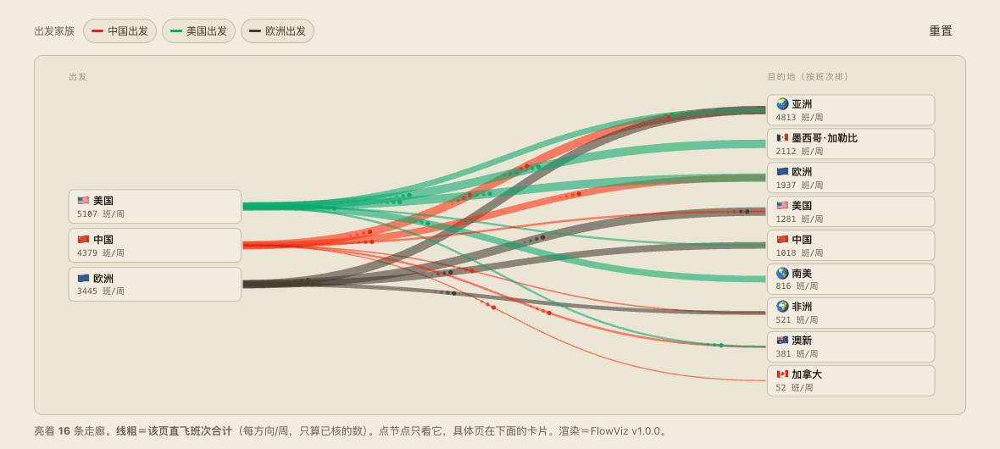
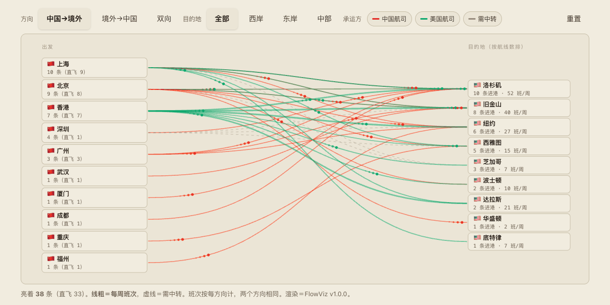

# Route Atlas · 航线图志

> English README: [README.md](README.md)

[](#)
[](#)
[](#)
[](LICENSE)


按**出发地**分家族的国际航线情报页。每页一张流向图 ＋ 逐线表 ＋ 政策与航权背景，中文，来源分级，未核项单独列。

```
中国出发/   中美 · 中欧（十三国＋香港）· 中亚 · 中澳新 · 中加 · 中非
美国出发/   美中(镜像) · 美欧 · 美亚 · 美墨加勒比 · 美南美 · 美澳新
欧洲出发/   欧中(镜像) · 欧美(镜像) · 欧亚 · 欧非
```

同一批航线在不同家族里是**同一份数据、不同视角**：镜像页在模块里声明 `MIRROR_OF = "usa"` 借源数据，只写自己的叙事与默认方向（样板 `regions/us_cn.py`）。





## 怎么生成

数据在 `regions/*.py`，页面是生成物，**不要手改 HTML**。

```bash
python3 tools/build_region_page.py            # 全部
python3 tools/build_region_page.py europe     # 一张
python3 tools/build_index.py                  # 三家族 index + 站首页
python3 tools/inject_flowviz.py inject 中国出发/*航线.html 美国出发/*航线.html 欧洲出发/*航线.html index.html
python3 tools/build_theme.py
```

顺序固定：生成区域页 → 生成 index → 注入流向图运行时 → 注入调色板。`--check` 两道已挂 pre-commit。

## 口径

- 班次一律**每方向每周**，对飞两个方向相同
- 来源分级：**[A]** 航司排期备案／官网时刻（最强）· **[S]** 机场或官方新闻稿 · **[D]** 时刻聚合库（不区分实际承运与代码共享）· **[C]** 行业媒体
- **逐线票价一律未核**：聚合器报价含中转、随日期剧烈波动、不区分方向，填进去是假精确
- 每页末节列「已知未核项」，**不得当事实用**
- 航季换季（每年 3 月底、10 月底）会大改班次，**换季后必须重核**

## 设计

壳与调色板同 [Market Chronicle](https://chronicle.klay-wang.com)：米色／夜色、目录胶囊、日夜切换、星空。流向图走 `flow-viz` skill 的嵌入式运行时，红线＝中国航司、绿线＝对方航司、灰虚线＝已退出或无直飞。README 里的动图用 `tools/record_flow_gif.py` 从实际页面录，换季重核后重录一遍。

## 状态

见 [HANDOFF.md](HANDOFF.md)。研究员原始报告在 `research/`（索引见 [research/README.md](research/README.md)）。

## 许可

[PolyForm Noncommercial 1.0.0](LICENSE)：可自由阅读、引用、非商业使用与改编，商业使用须另行授权。
